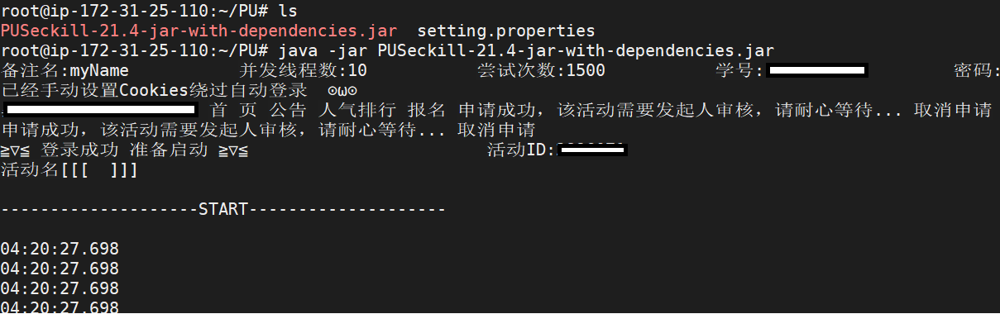

# 基于原先项目环境，可以部署服务器或者有公网ip的PC上，如果使用宝塔，取消禁用php中exec函数
# //请求示例：https://xxxxxx.com/index.php?time=yyyyMMdd HHmmss&id=活动id
# 初学php，弱鸡写法，轻点喷
# PU口袋校园活动定时报名

**由于本多线程自动化程序过于暴力从未失误,由此影响重要学分甚至评优评先 改变人生轨迹的,找使用者负责**
基本不再维护了,登录流程经常改,以后自己复制cookies吧
*有投诉随时跑路*

### 准备工作

- 电脑端浏览器(Edge Chrome Firefox)
- JDK1.8
- 记得账号密码或会复制cookies
- 会用记事本修改.properties配置文件

### 完成网页登录

#### A.或使用账号密码自动登录

- 修改配置文件  
  Student_ID=  
  Password=

#### B.或复制浏览器的cookies

- 浏览器登录完成->按键盘F12选择Console(控制台)->输入> document.cookie复制  
  cookies不包含引号 cookies失效期为10小时(Hm_lvt是广告没用)
- 修改配置文件  
  useLocalCookies=true  
  myCookies=TS_LOGGED_USER=jOmNeupLIO4kpu....

### 获取学校的主机名 和 学校编号(必须)

- 使用[电脑网页版PU口袋校园](https://www.pocketuni.net/index.php?app=home&mod=Public&act=login) 首先完成一次登录(扫码登录也可)
  **记录下跳转后的网址**

  > 例如 ***https://jlnku.pocketuni.net/***
  >
  >  jlnku 是主机名 pocketuni.net是二级域名
- 从School id list.txt找到( 17495-吉林农业**学院 ) 或者 *手动从登录界面的前端中找*
- 修改配置文件  
  schoolName_for_short=jlnku  
  school_Id=17495

### 获得活动编号

- 点入一个活动
  
  > 例如https://jlnku.pocketuni.net/index.php?app=event&mod=Front&act=index&id=2721774
- activityID_1为 2721774 ~~uid没用~~
- **一人同时**需要两个活动就把activityID_2设置为0以外的值
- 修改配置文件  
  activityID_1=2721774  

### 快速启动

把配置好的 setting.properties 放到 PUSeckill-*.jar 包同路径下 
>  **java -jar (完整路径)\PUSeckill-21.4-jar-with-dependencies.jar**

### 提示

- 定时启动 ifSchedule=true 提前4秒启动即可(完成登录需要1.5秒)
- 使用定时器+多个配置文件 方便同时多人报名
- 多线程别把服务器挤坏了 半秒内都能报上 报上了就关了
- 线程数设置5差不多得了
- 定时启动 yyyy-MM-dd HH:mm:ss 例如2020-12-19 12:59:50 24小时制
- 前端可能会改,登录失败先用cookies
- maven package 打包成jar
- **java -jar PUSeckill-21.4-jar-with-dependencies.jar** 可以部署到Linux服务器上 不要忘记附带配置文件

  
  

### 鸣谢

多位神秘校友的大力支持
